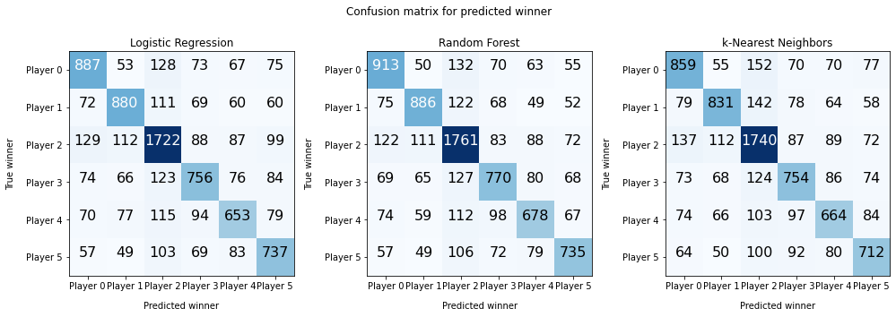
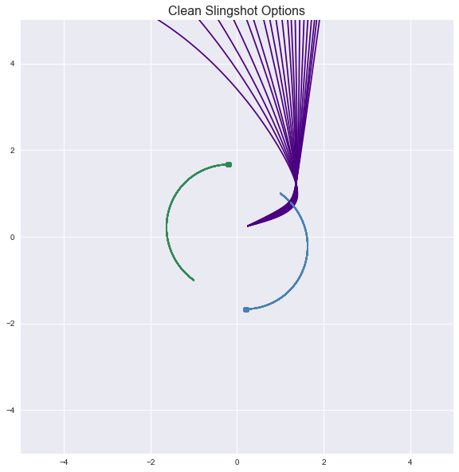

# Caleb Wilson

### Welcome to my personal github portfolio!

Hello my name is Caleb Wilson and I am an aspiring applied mathematician. I like math, programming, machine learning, and strategy games. This github portfolio is here to showcase some of my work.

### Risk Game analysis with PyRisk

**Above:** A comparison of different classification methods used to predict the winner of a risk game. The Confusion matrix
shows how many times they classified a certain player winning vs which player actual won. The dark blue diagonal indicates
that the classifiers performed well.

For a school project, my group and I set out to analyze Risk gameplay and predict a winner based on an unfinished game.
We found an open source engine written in Python called PyRisk that had the capability for different computer bots to play 
Risk against each other. We forked the repository and made changes to generate lots of game data. Then we wrote code to parse
that data into Pandas dataframes. We engineered features like continent control, some graph based features, and troop count
features. Then we applied several machine learning classifiers, like Random Forests, Logistic  Regression, K-nearest
neighbors, and XGBoost to try to predict the winning player. We ran grid searches to find the optimal hyperparameters for
training the classifiers. We used the Random Forest classifiers we trained to show us which features were more important in
predicting the data. We also visualized the data we collected with a t-SNE projection.

I modified PyRisk to run games in parallel so our data generation would be faster. I also wrote code to run logisitic
regression, random forest, and k-nearest neighbors classifiers on the data to predict the winner. Because the data we
collected was high-dimensional, I used Principle Component Analysis to reduce the dimensionality of the data before feeding it
to the k-nearest neighbors classifier. For a fuller explanation, please see the report linked below.

 - [Repository](https://github.com/LukasErekson/pyrisk)
 - [Report (PDF)](RISK_Data_Project_Fall_2020.pdf)

### Gravitational Slingshot physics simulation

**Above:** By varying the initial velocity slightly, we were able to plot out several different possible slingshot
trajectories for a satellite in our model. While this is plotted in 2d for simplicity, we also did some 3d simulations,
plots, and animations.

For a school project, my group wrote python code to simulate gravitational attraction in an n-body system.
Then we found initial conditions that would allow a small or zero mass object to slingshot off of a more massive object,
like in space missions. We ended up with some cool results and with code that given an initial guess could find an initial
velocity to slingshot an object to a trajectory that would approximately pass through some desired point in space.

I wrote 2d and 3d plotting and animation code, including initial/final velocities, energies, and an acceleration vector
field. I also helped find initial conditions that led to a gravitational slingshot.

 - [Repository](https://github.com/samcochran/Gravitational-Slingshot)
 - [Animations](https://samcochran.github.io/Gravitational-Slingshot/)
 
### UniWar

UniWar is an online multiplayer turn based strategy game. I worked part time to fix bugs and add new features to the app.

 - [UniWar Website](https://www.uniwar.com)
